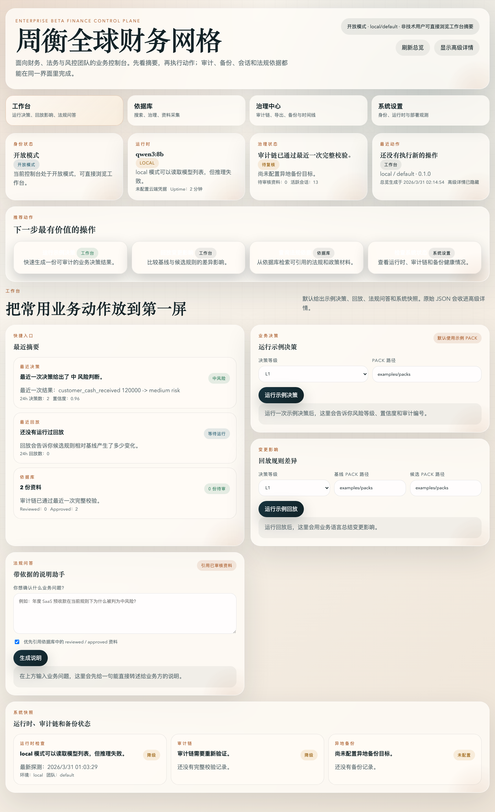
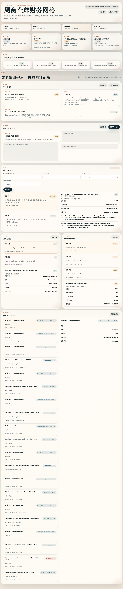
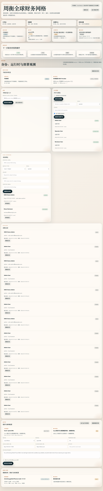

# Zhouheng Global Finance Mesh

Enterprise beta finance control plane for Pack validation, deterministic decision packets, replay analysis, governed legal grounding, OIDC-ready operator sessions, a summary-first operator console, and a tamper-evident SQLite audit ledger.

This repository turns the Zhouheng Global Finance Mesh design into a runnable product baseline instead of a document-only spec. It is not an OpenClaw sub-skill; OpenClaw support remains optional under `integrations/openclaw/`.

## Console snapshots

<p align="center">
  
  
  
</p>

## What ships in the current baseline

- four-workspace Chinese-first web console for business and governance teams:
  - `工作台` for decisions, replay, assistant guidance, and system snapshots
  - `依据库` for legal-source search, review, and ingestion
  - `治理中心` for integrity, exports, backups, and timelines
  - `系统设置` for identity, runtime, and observability
- service-side operator sessions with `HttpOnly` cookies, CSRF protection, logout, revoke, and active-session inspection
- hybrid identity model: break-glass local tokens plus standards-based OIDC authorization-code login
- `viewer`, `operator`, `reviewer`, and `admin` roles with subject/email identity bindings for OIDC users
- pluggable Ollama brain runtime for local and cloud deployments
- TypeScript rule engine for Pack validation, decision generation, and replay analysis
- legal library store with ingestion, tagging, governed status workflow, search, and citation grounding
- append-only SQLite audit ledger for decision, replay, runtime probe, integrity verification, export batches, and operator activity
- local-directory and S3-compatible backup replication for ledger/session snapshots
- `/api/dashboard/overview`, `/api/operations/health`, and Prometheus-friendly `/api/metrics`
- structured request logging with request, actor, run, and backup references
- persisted operator activity timeline for RBAC, session, runtime, legal-library, and release actions
- example Country, Industry, Entity, Control, and Output Packs
- example SaaS annual prepayment event
- node:test coverage for validation, decisioning, replay, legal library, audit storage, OIDC binding, and cookie-session flows
- Docker single-instance baseline plus raw Kubernetes manifests for one-replica deployment

## Architecture

The standalone control plane is now the primary product surface. OpenClaw remains an optional integration layer, not the product identity.

- Why: this keeps the repo honest about what it is actually building, while still preserving adapter compatibility for existing workflows.
- Trade-off: the first release still runs as one Node process, so long-term connector isolation and hardened persistence remain future work.
- Upside: we can validate finance domain semantics, operator workflows, and auditability before splitting into more services.

See [ADR-001](./docs/ADR-001-standalone-control-plane.md) for the decision record.

## Repository layout

- `src/`: engine, validation, replay, audit-store, audit-ledger, activity-store, and runtime implementations
- `src/server.ts`: browser-accessible control plane
- `web/`: single-page operator console
- `data/legal-library/library.json`: starter legal library corpus
- `data/audit/ledger.sqlite`: source-of-truth audit ledger
- `data/audit/runs.json`: legacy audit import source retained for one-time migration/backups
- `data/audit/activity.json`: legacy activity import source retained for one-time migration/backups
- `data/audit/exports/`: generated NDJSON exports and manifest files
- `examples/packs/`: example Pack files
- `examples/events/`: example event payloads
- `integrations/openclaw/`: optional OpenClaw adapter, manifest, and bundled skill
- `tests/`: regression tests
- `docs/`: architecture, launch, and handoff docs

## Quick start

```bash
npm install
npm test
npm run dev
```

Then open [http://127.0.0.1:3030](http://127.0.0.1:3030).

The landing experience is now a summary-first workbench intended to stay understandable for non-technical operators. Raw JSON and ids are still there, but they live behind advanced details.

To wire a cloud brain without committing secrets, set environment variables locally:

```bash
export OLLAMA_MODE=cloud
export OLLAMA_API_KEY=your_key_here
export OLLAMA_MODEL=qwen3:8b
npm run dev
```

The UI also lets you enter the API key at runtime; it is not persisted unless you explicitly opt in.

## Identity and access

The product now ships with an enterprise beta identity baseline.

- bootstrap the first admin in the Access Control panel or with `FINANCE_MESH_BOOTSTRAP_ADMIN_*` env vars
- use a break-glass local token to mint a server session when `FINANCE_MESH_ALLOW_LOCAL_TOKENS=true`
- enable OIDC with `FINANCE_MESH_BASE_URL`, `FINANCE_MESH_OIDC_ISSUER`, `FINANCE_MESH_OIDC_CLIENT_ID`, and `FINANCE_MESH_OIDC_CLIENT_SECRET`
- bind OIDC users to platform roles with exact `issuer + subject` or verified-email matching
- protect cookie-authenticated writes with `x-finance-mesh-csrf`
- inspect and revoke active sessions from the Access Control panel or `/api/access-control/sessions`

Minimal OIDC setup looks like this:

```bash
export FINANCE_MESH_AUTH_ENABLED=true
export FINANCE_MESH_BASE_URL=https://finance-mesh.example.com
export FINANCE_MESH_OIDC_ISSUER=https://id.example.com
export FINANCE_MESH_OIDC_CLIENT_ID=finance-mesh-console
export FINANCE_MESH_OIDC_CLIENT_SECRET=replace_me
export FINANCE_MESH_OIDC_SCOPES="openid profile email"
export FINANCE_MESH_ALLOW_LOCAL_TOKENS=true
npm run dev
```

See [docs/identity-operations.md](./docs/identity-operations.md) for full bootstrap, OIDC, session-revoke, and CSRF troubleshooting steps.

## Legal library governance

Legal-library documents now carry lifecycle state.

- new documents start as `draft`
- reviewers can promote documents to `reviewed` or `approved`, or retire them
- default search grounding for agent context only uses `reviewed` and `approved` documents
- the seeded example legal corpus is pre-marked as `approved` so the repo still works out of the box

## Audit history

Every decision, replay, runtime probe, integrity verification, export batch, and operator governance event now lands in `data/audit/ledger.sqlite`.

- the web console shows decision/replay history, probe history, operator activity, and a dedicated audit integrity panel
- legacy `runs.json` and `activity.json` files are migrated once on first boot if they exist, then kept as backup artifacts instead of active storage
- the ledger survives restarts, supports whole-chain verification, and can export NDJSON slices with signed manifests
- the ledger can also be snapshotted and replicated to mounted-directory or S3-compatible targets
- this is tamper-evident storage with durability support, not yet immutable archival storage

## Operator activity

Privileged actions are part of the same audit chain.

- bootstrap admin, access-policy changes, operator issuance, runtime updates, legal-library governance actions, probe runs, decisions, and replays all generate operator activity entries
- integrity verification and export batches are ledger-native events surfaced through the audit integrity panel and export detail views
- the web console exposes a separate operator activity panel so admins can inspect governance actions without digging through raw files
- activity events are actor-stamped when auth is enabled and still persist in auth-disabled local development mode

## Integrity and export operations

- `GET /api/audit/integrity` exposes the latest chain state, migration summary, staleness, and latest export metadata
- `POST /api/audit/integrity/verify` replays the ledger hash chain and seals the verification result back into the ledger
- `POST /api/audit/exports` writes an NDJSON slice plus JSON manifest under `data/audit/exports/`
- reviewers can inspect integrity/export status; admins can trigger verification and new exports

## Backup and observability

- `GET /api/operations/health` provides runtime, ledger, legal-library, and backup-target health in one response
- `GET /api/metrics` exposes Prometheus text metrics for HTTP traffic, runs, sessions, integrity verification, and backups
- `POST /api/operations/backups/run` creates a snapshot bundle under `data/backups/` and replicates it to configured targets
- `FINANCE_MESH_BACKUP_LOCAL_DIR` enables mounted-directory replication
- `FINANCE_MESH_BACKUP_S3_*` enables S3-compatible object replication
- `FINANCE_MESH_LOG_FORMAT=json` enables structured logs for containerized or aggregator environments

## Deployment baseline

- `Dockerfile` and `docker-compose.yml` provide a single-instance container baseline
- `deploy/kubernetes/` contains ConfigMap, Secret example, Deployment, Service, PVC, and Ingress example manifests
- the deployment posture is intentionally stateful and single-replica; it is a beta baseline, not an HA claim

## Finance flow

1. `finance_mesh_validate_packs`
   Validates Pack metadata, sources, approvals, rollback coverage, and duplicate rule ids.
2. `finance_mesh_run_decision`
   Loads Packs, evaluates precedence, checks evidence gaps, emits a Decision Packet, and persists the run summary.
3. `finance_mesh_replay`
   Compares baseline and candidate Pack sets across historical events and persists the replay outcome for review.

## Optional OpenClaw integration

If you still need OpenClaw compatibility, load the adapter from `integrations/openclaw/`.

```json
{
  "plugins": {
    "load": {
      "paths": ["/absolute/path/to/zhouheng-global-finance-mesh/integrations/openclaw"]
    },
    "entries": ["zhouheng-global-finance-mesh"]
  }
}
```

## Delivery posture

This repo is intentionally honest about scope.

- included: Pack authoring pattern, validation, deterministic decision generation, replay summary, hybrid OIDC/local identity, cookie sessions with CSRF, SQLite audit ledger, backup replication, runtime probe history, operator activity logging, integrity verification, export manifests, deployment/observability baseline, pluggable Ollama brain support, web console, and legal-library grounding
- not yet included: SCIM or group sync, immutable archival audit persistence, HA session replication, ERP-side writeback adapters, or full production governance workflows

See [docs/enterprise-readiness.md](./docs/enterprise-readiness.md) for a candid checklist.

## Docs

- [docs/identity-operations.md](./docs/identity-operations.md)
- [docs/deployment-baseline.md](./docs/deployment-baseline.md)
- [docs/roadmap.md](./docs/roadmap.md)
- [docs/marketing-launch.md](./docs/marketing-launch.md)
- [docs/handoff-to-openclaw-self-operator.md](./docs/handoff-to-openclaw-self-operator.md)
- [docs/long-term-evolution-plan.md](./docs/long-term-evolution-plan.md)
- [docs/audit-operations.md](./docs/audit-operations.md)
- [docs/checkpoint-2026-03-31-enterprise-beta-identity.md](./docs/checkpoint-2026-03-31-enterprise-beta-identity.md)
- [docs/checkpoint-2026-03-31-console-backup-observability.md](./docs/checkpoint-2026-03-31-console-backup-observability.md)

## Contribution surface

- [CONTRIBUTING.md](./CONTRIBUTING.md)
- [CHANGELOG.md](./CHANGELOG.md)
