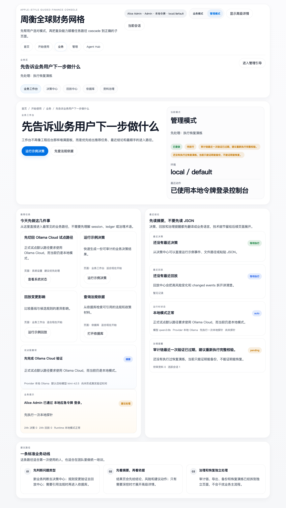
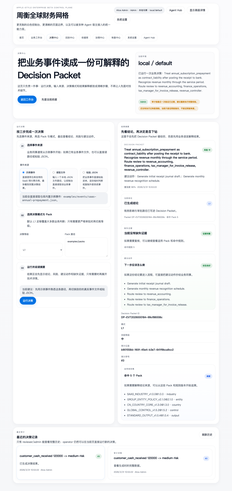
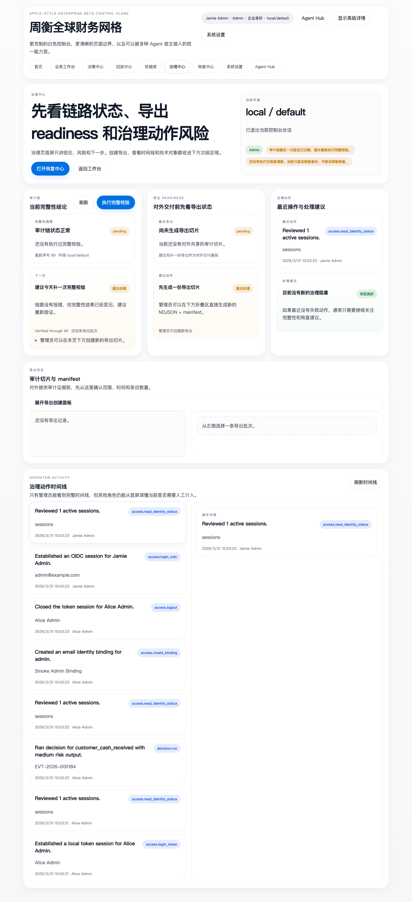
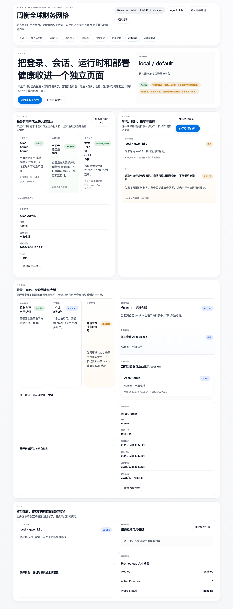
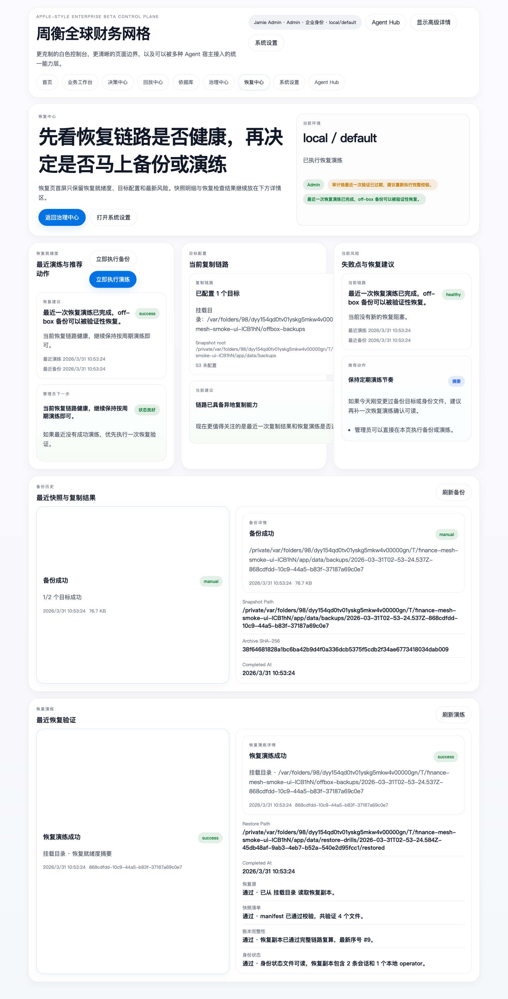
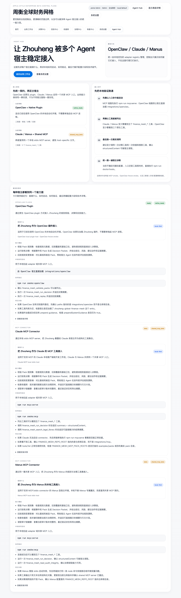

# Zhouheng Global Finance Mesh

这是一个独立的财务控制平面产品仓库，不再把自己包装成 OpenClaw 的附属 skill。它把“宙衡 Global Finance Mesh”从规格文档推进成了可运行、可验证、可持续演进的产品基线，并补上了 OIDC-ready 身份层、服务端 session、面向非技术人员的白色多页面业务控制台、摘要看板优先的后台页、面向 Claude / Manus / OpenClaw 的统一兼容层、带结构化输出的 MCP 工具契约、异地备份与恢复演练能力，以及基于 SQLite 的防篡改审计账本。

## 控制台截图

<p align="center">
  
  
  
  
  
  
</p>

## 已落地内容

- 九页面中文控制台，按任务路径拆开，不再把所有功能堆在一屏里：
  - `首页`：品牌首页、环境摘要、角色入口
  - `业务工作台`：推荐动作、建议路径与最近结果
  - `决策中心`：按“事件来源 -> 决策模式 / Pack -> 结果摘要”三步运行决策
  - `回放中心`：按“事件来源 -> 基线 / 候选 Pack -> 差异摘要”三步查看规则漂移
  - `依据库`：搜索优先，治理与采集退到 reviewer/admin 的次级面板
  - `治理中心`：审计链、导出、Operator Activity，首屏先给结论和下一步
  - `恢复中心`：备份、恢复演练、恢复建议，失败点与推荐动作优先展示
  - `系统设置`：身份、会话、运行时、部署健康，管理表单退到次级折叠区
  - `Agent Hub`：OpenClaw / Claude / Manus 接入说明，按“能做什么 -> 如何启动 -> 如何验证 -> 技术详情”展开
- 服务端 operator session：`HttpOnly` cookie、CSRF、防登出残留、active session 查看与 revoke
- 混合身份模式：break-glass 本地 token + 标准 OIDC authorization-code 登录
- `viewer`、`operator`、`reviewer`、`admin` 四级角色，以及基于 `issuer + subject` / verified email 的 OIDC 身份绑定
- 可插拔 Ollama 大脑，支持本地与云端模式
- Pack 校验、决策生成、回放对比、审计追溯快照
- 法律资料库采集、检索、治理状态流转、引用注入链路
- 基于 SQLite 的 append-only 审计账本，统一记录 decision / replay / runtime probe / integrity verify / export batch / operator activity
- 目录复制与 S3-compatible 对象存储两种异地备份目标
- 非破坏性的恢复演练，支持从挂载目录、S3-compatible 目标或本地 snapshot 验证恢复可行性
- `/api/dashboard/overview`、`/api/operations/health`、`/api/metrics` 三个聚合 / 观测接口
- `/api/integrations/adapters` 与 `/api/integrations/adapters/:id` 两个统一适配器发现接口
- 五个共享 MCP 工具现在都带人类摘要、`structuredContent` 和 `outputSchema`
- 结构化日志，便于请求、actor、run、backup 的串联排查
- 持久化 operator activity timeline，记录 RBAC、session、运行时配置、法规治理和执行动作
- 统一 local-first adapter registry：OpenClaw 原生插件 + Claude/Manus MCP connector
- SaaS 年付预收场景示例
- 可选 OpenClaw 兼容层，集中放在 `integrations/openclaw/`
- Docker 单实例基线与 Kubernetes 原生单副本清单
- GitHub Actions CI 与 semver 发布流程，覆盖语法校验、restore smoke、浏览器 smoke、镜像发布和 npm 发布

## 当前定位

它不是“财务问答机器人”，也不是“某个宿主的附属插件壳”，而是一个规则网格驱动的财务决策中枢骨架。

- 输入是经济事件与上下文
- 中间层是 Pack 规则和优先级
- 输出是可审计的 Decision Packet 与可回放的变更结果

## 快速开始

```bash
npm install
npm test
npm run dev
```

然后访问 `http://127.0.0.1:3030`。

默认入口现在是 `首页`，随后进入 `业务工作台`。先给业务可读结论和推荐动作，原始 JSON 与底层技术字段都收进了高级详情。

如果走云端模型，可以本地设置：

```bash
export OLLAMA_MODE=cloud
export OLLAMA_API_KEY=你的本地环境变量
export OLLAMA_MODEL=qwen3:8b
npm run dev
```

默认不会持久化 API key，除非你在 UI 里主动勾选保存到本地忽略文件。

## 身份与访问控制

当前版本已经具备企业 beta 的身份与会话基线。

- 可以在 Access Control 面板里 bootstrap 第一个 admin
- 也可以通过 `FINANCE_MESH_BOOTSTRAP_ADMIN_*` 环境变量预置第一个管理员
- 本地 token 不再作为浏览器长期凭据，而是用来 mint 服务端 session
- 打开 OIDC 后，可以通过 subject / verified email binding 把企业身份映射到平台角色
- 所有 cookie session 的写请求都要带 `x-finance-mesh-csrf`
- admin 可以直接查看和撤销活动 session，reviewer/admin 可以继续查看审计完整性

最小 OIDC 配置示例：

```bash
export FINANCE_MESH_AUTH_ENABLED=true
export FINANCE_MESH_BASE_URL=https://finance-mesh.example.com
export FINANCE_MESH_OIDC_ISSUER=https://id.example.com
export FINANCE_MESH_OIDC_CLIENT_ID=finance-mesh-console
export FINANCE_MESH_OIDC_CLIENT_SECRET=replace_me
export FINANCE_MESH_OIDC_SCOPES="openid profile email"
export FINANCE_MESH_ALLOW_LOCAL_TOKENS=true
npm run dev
```

完整流程见 [docs/identity-operations.md](./docs/identity-operations.md)。

## 多页面控制台

控制台已经不再是单页切 tab 的后台壳。

- `index.html`：品牌首页
- `workbench.html`：业务首页，直接使用 `/api/dashboard/overview` 的推荐动作
- `decisions.html`：三段式决策执行页
- `replays.html`：三段式回放分析页
- `library.html`：搜索优先的依据库阅读页
- `governance.html`：治理中心
- `recovery.html`：恢复中心
- `system.html`：系统设置
- `agents.html`：Agent Hub

这样做的目标很直接：让非技术人员先看懂页面边界，再决定要不要进入高级详情。

## 多 Agent 兼容层

这轮开始，仓库不再只有 OpenClaw 一条兼容路径。

- `integrations/openclaw/`：原生 OpenClaw 插件适配
- `integrations/mcp/server.ts`：共享 MCP server 入口
- `integrations/claude/`：Claude 本地接入说明与示例配置
- `integrations/manus/`：Manus 本地接入说明与示例配置
- `npm run mcp:serve`：直接启动共享 MCP connector
- `npm run smoke:mcp`：本地验证五个工具可见，并真实调用决策与法规搜索
- `npm run smoke:openclaw`：在 fixture host 里加载 OpenClaw 原生插件并验证三类工具与 prompt guidance
- `npm run doctor:hosts`：统一检查三家配置模板、接入文档、共享 MCP smoke 和 OpenClaw fixture smoke

当前统一暴露的工具面包括：

- Pack 校验
- 决策运行
- 回放运行
- 法律资料检索
- 审计完整性读取

这五个共享 MCP 工具现在都固定返回：

- 一段宿主可直接展示的人类摘要
- 稳定的 `structuredContent`
- 明确的 `outputSchema`

这样 Claude 与 Manus 共用同一套本地契约，OpenClaw 则继续走原生插件面，但静态清单和 smoke 也会被同一套契约持续校验。

## 审计历史

本轮开始，审计真相源已经切到 `data/audit/ledger.sqlite`。

- decision、replay、runtime probe、integrity verify、export batch 和 operator activity 全都进入同一条 hash chain
- 控制台里可以直接看到最近运行历史、完整明细和独立的 integrity 面板
- 旧的 `data/audit/runs.json` 与 `data/audit/activity.json` 如果存在，会在首次启动时一次性迁移到 SQLite，然后保留为历史备份
- 这已经是 tamper-evident 的审计底座，并且支持把快照复制到目录或 S3-compatible 目标，但还不是不可变归档级企业存储

## Operator Activity

治理动作现在也进入同一条 SQLite 审计链。

- bootstrap admin、访问控制开关、operator 发放、runtime 配置变更、法规状态流转、probe、decision、replay 都会写入 Operator Activity 时间线
- integrity verify 和 export batch 作为账本原生事件展示在 Audit Integrity 面板和导出详情里
- 控制台提供独立的 Operator Activity 面板，方便 admin 直接复盘后台治理动作
- 开启 auth 后会附带操作者身份；本地开发模式下即使 auth 关闭也会继续落盘

## Integrity 与导出

- reviewer 可以查看 `GET /api/audit/integrity` 和导出结果
- admin 可以触发 `POST /api/audit/integrity/verify` 以及 `POST /api/audit/exports`
- 导出物会落到 `data/audit/exports/`，包含 NDJSON 数据文件和 JSON manifest
- 运维恢复时可以恢复 `ledger.sqlite`，重新执行 integrity verify，再核对 export manifest hash

## 备份与观测

- `GET /api/operations/health`：面向运维和系统页的详细健康状态
- `GET /api/metrics`：Prometheus 文本指标
- `POST /api/operations/backups/run`：手动生成快照并复制到已配置目标
- `GET /api/operations/restores`、`POST /api/operations/restores/run`、`GET /api/operations/restores/:id`：在隔离目录里执行恢复演练并返回摘要结果
- `FINANCE_MESH_BACKUP_LOCAL_DIR`：挂载目录复制
- `FINANCE_MESH_BACKUP_S3_*`：S3-compatible 对象存储复制
- `FINANCE_MESH_RESTORE_DRILL_RETENTION_DAYS`：控制 `data/restore-drills/` 下恢复演练目录的保留天数
- `FINANCE_MESH_RESTORE_DRILL_WARN_HOURS`：控制恢复就绪度在概览页和健康检查中多久后判定为过期
- `FINANCE_MESH_LOG_FORMAT=json`：容器化环境推荐的结构化日志模式

恢复演练不会覆盖运行中的 `data/`。系统会先把备份副本展开到 `data/restore-drills/<timestamp>-<drillId>/restored/`，然后校验 `manifest.json`、恢复后的账本完整性，以及身份状态文件是否可读，再给出就绪度结论。

## 部署基线

- `Dockerfile` + `docker-compose.yml`：单实例容器运行基线
- `deploy/kubernetes/`：ConfigMap、Secret 示例、Deployment、Service、PVC、Ingress 示例
- 当前明确按“单副本 + 持久卷”的 beta 自托管方式设计，不宣称高可用

## CI 与发布基线

- `.github/workflows/ci.yml` 会在 PR 和 `main` 上执行 `npm ci`、`npm test`、`npm run verify:server`、`npm run verify:manifests`、`docker build`、`npm run smoke:restore`、`npm run smoke:ui`
- `.github/workflows/release.yml` 只会在 `workflow_dispatch` 或 `v0.3.0` 这种 semver tag 上触发发布
- `npm run release:check -- --tag v0.3.0` 会强校验 git tag、`package.json` 版本和 `CHANGELOG.md` 标题一致
- CI 会在 `npm run verify:manifests` 前临时拉起一个 kind 集群，因为 `kubectl` 的 dry-run 仍然需要 API discovery 来识别内置资源
- 发布产物固定是 `ghcr.io/wd041216-bit/zhouheng-global-finance-mesh` 容器镜像和 npm 公共包

## 法律资料治理

法律资料库现在已经带状态治理。

- 新文档默认进入 `draft`
- reviewer 可以把文档推进到 `reviewed` 或 `approved`
- 默认 grounding 只会引用 `reviewed/approved` 文档
- 仓库自带的种子法规已经预设成 `approved`，开箱即用不会失去引用能力

## 宿主接入

如果你仍然需要接到 OpenClaw，请使用 `integrations/openclaw/` 下的适配器，而不是把整个仓库继续当成 skill 根目录。

如果是 Claude 或 Manus 这类支持 MCP 的宿主，则直接使用共享入口：

```bash
npm run mcp:serve
```

对应说明见：

- [integrations/mcp/README.md](./integrations/mcp/README.md)
- [integrations/claude/README.md](./integrations/claude/README.md)
- [integrations/manus/README.md](./integrations/manus/README.md)

## 企业化边界

这版已经具备产品骨架，但我不会不诚实地宣称它“已经企业标准完成”。

已具备：
- 大脑接入层
- 中文 Web 操作台
- 法律资料库基础管理
- 可解释决策与回放
- OIDC-ready 身份绑定、服务端 session、CSRF 与角色边界
- SQLite 审计账本、integrity verify 和导出链路
- 目录 / S3-compatible 备份复制
- 非破坏性恢复演练与恢复就绪度摘要
- CI 校验与 semver 发布基线
- Docker / Kubernetes 单实例部署与基础观测

仍需继续补齐：
- SCIM / 群组映射 / 更强的身份联邦
- 不可变审计存储与更强的防篡改归因
- 真实 ERP / 审批流连接器
- 更大规模的法规资料装载与签核机制

## 相关文档

- [docs/identity-operations.md](./docs/identity-operations.md)
- [docs/restore-drill-operations.md](./docs/restore-drill-operations.md)
- [docs/deployment-baseline.md](./docs/deployment-baseline.md)
- [docs/roadmap.md](./docs/roadmap.md)
- [docs/marketing-launch.md](./docs/marketing-launch.md)
- [docs/handoff-to-openclaw-self-operator.md](./docs/handoff-to-openclaw-self-operator.md)
- [docs/long-term-evolution-plan.md](./docs/long-term-evolution-plan.md)
- [docs/audit-operations.md](./docs/audit-operations.md)
- [docs/checkpoint-2026-03-31-enterprise-beta-identity.md](./docs/checkpoint-2026-03-31-enterprise-beta-identity.md)
- [docs/checkpoint-2026-03-31-console-backup-observability.md](./docs/checkpoint-2026-03-31-console-backup-observability.md)
- [docs/checkpoint-2026-03-31-recovery-ci-release.md](./docs/checkpoint-2026-03-31-recovery-ci-release.md)
- [docs/checkpoint-2026-03-31-apple-ui-agent-hub.md](./docs/checkpoint-2026-03-31-apple-ui-agent-hub.md)
